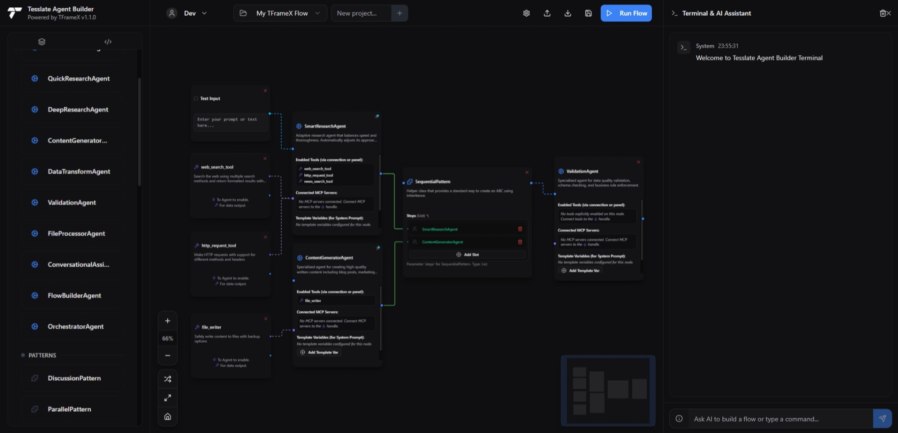
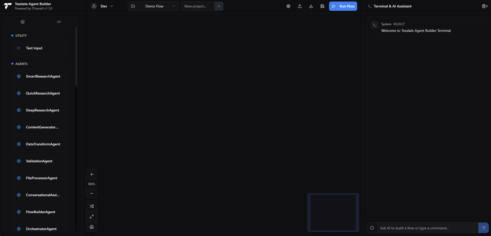
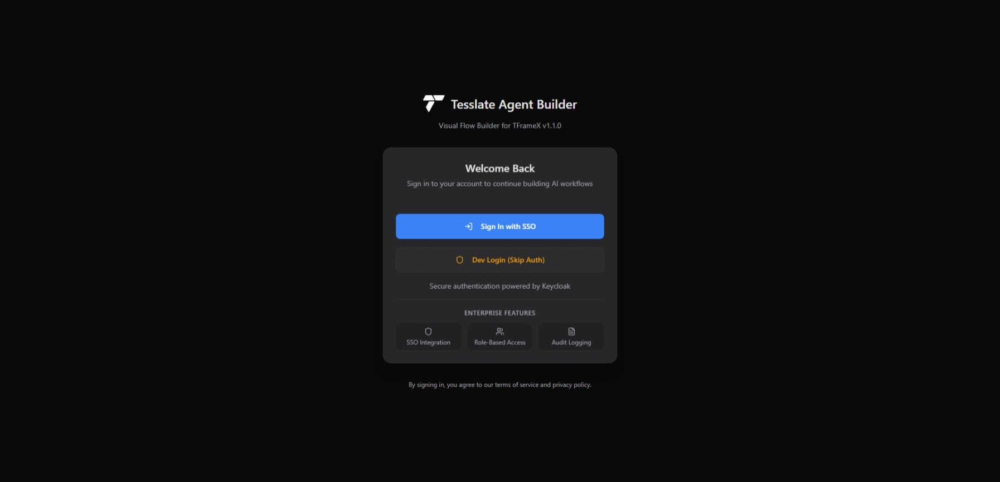
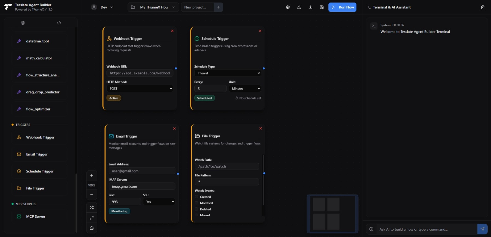

# Agent-Builder for TFrameX v1.1.0



<p align="center">
  <strong>Enterprise-grade visual agent builder for TFrameX - Create, deploy, and manage sophisticated LLM workflows with a powerful drag-and-drop interface.</strong>
</p>

<p align="center">
  <a href="https://pypi.org/project/tframex/">
    
  </a>
  <a href="LICENSE">
    
  </a>
  <a href="https://github.com/TesslateAI/Agent-Builder">
    
  </a>
  <a href="https://hub.docker.com/r/tesslate/agent-builder">
    
  </a>
</p>

Please join our discord for support: [Discord](https://discord.gg/DkzMzwBTaw)

---

**Agent-Builder** is a comprehensive visual development environment for [TFrameX v1.1.0](https://github.com/TesslateAI/TFrameX), providing enterprise-grade features for building, testing, and deploying multi-agent LLM systems. With built-in authentication, database persistence, and production-ready infrastructure, it's the complete solution for LLM workflow orchestration.



## ✨ Key Features

### 🚀 Core Capabilities
- **🎨 Visual Flow Designer**: Intuitive drag-and-drop interface powered by ReactFlow
- **🤖 TFrameX 1.1.0 Integration**: Complete support for all framework features
- **🔌 MCP Support**: Model Context Protocol integration for external tools and services
- **📦 Import/Export**: Share and version control your flows as JSON
- **🛠️ Dynamic Code Registration**: Add agents and tools on-the-fly without restart
- **🎯 Multi-Model Support**: Configure different LLMs for each agent (OpenAI, Anthropic, Ollama)
- **⚡ Hot Reload Development**: Fast iteration with Docker Compose volumes

### 🏢 Enterprise Features
- **🔐 Authentication**: Keycloak OAuth2/OIDC integration
- **👥 Multi-Tenancy**: Organization-based isolation
- **🔑 RBAC**: Role-based access control with hierarchical permissions
- **📊 Audit Logging**: Complete activity tracking
- **💾 Database Persistence**: PostgreSQL with Alembic migrations
- **🚦 Health Monitoring**: Comprehensive health check endpoints
- **📈 Metrics & Telemetry**: Production monitoring ready

### 🎯 Workflow Triggers (Experimental)
- **🌐 HTTP/Webhook Triggers**: REST API endpoints for flow execution
- **⏰ Schedule Triggers**: Cron-based workflow automation
- **📧 Email Triggers**: Process incoming emails (requires SMTP configuration)
- **📁 File Watchers**: Monitor directories for changes
- **📬 Event Triggers**: Custom event-driven workflows
- **🔗 Integration Ready**: Extensible for GitHub, Slack, and custom webhooks

## 🚀 Quick Start

### 🐳 Docker Compose (Recommended)

The fastest way to get started with full enterprise features:

```bash
# Clone the repository
git clone https://github.com/TesslateAI/Agent-Builder.git
cd Agent-Builder

# Configure environment
cp deploy/docker/.env.example deploy/docker/.env
# Edit .env with your API keys

# Start all services
docker-compose -f deploy/docker/docker-compose.dev.yml up -d

# Access the application
# Frontend: http://localhost:5173
# Backend API: http://localhost:5000
# Keycloak Admin: http://localhost:8081 (admin/admin)
```

### 🖥️ Local Development

For development with hot reload:

```bash
# Quick start script
./scripts/dev/start-dev.sh

# OR using Python
python scripts/dev/start-dev.py
```

### 🔧 Local TFrameX Development

If you're developing TFrameX locally alongside Agent-Builder:

```bash
# Clone both repositories to the same parent directory
cd /path/to/parent
git clone https://github.com/TesslateAI/TFrameX.git
git clone https://github.com/TesslateAI/Agent-Builder.git

# Agent-Builder will automatically detect and use local TFrameX
cd Agent-Builder
./scripts/dev/start-dev.sh
```

This setup allows you to:
- Modify TFrameX source code and see changes immediately
- Test new TFrameX features in the visual builder
- Develop both projects simultaneously

### 📦 Standard Installation

When TFrameX 1.1.0 is published to PyPI:

```bash
# Using Make
make install     # Install dependencies and build
make run         # Run in production mode (serves at http://localhost:5000)

# OR manual setup
uv venv
source .venv/bin/activate  # On Windows: .venv\Scripts\activate
uv pip install -e .
cd builder/frontend && npm install && npm run build
cd ../..
cd builder/backend && python app.py
```

The application will be available at **http://localhost:5000** (production) or **http://localhost:5173** (development)

## 🏗️ Architecture

### Technology Stack

| Layer | Technologies |
|-------|--------------|
| **Frontend** | React 18, ReactFlow, Zustand, Vite 6, shadcn/ui, Tailwind CSS |
| **Backend** | Flask, TFrameX v1.1.0, SQLAlchemy 2.0 |
| **Database** | PostgreSQL, Redis, Alembic migrations |
| **Authentication** | Keycloak (OAuth2/OIDC), JWT |
| **Infrastructure** | Docker, Traefik, Docker Compose |
| **Development** | Hot reload, PgAdmin, RedisInsight |
| **Testing** | pytest, API integration tests |

**Core Stack**: React + Vite + ReactFlow (Frontend) • Flask + TFrameX (Backend)

## 📋 Prerequisites

- **Docker & Docker Compose** (recommended)
- **Python 3.8+** (for local development)
- **Node.js 18+** (for frontend development)
- **LLM API Access** (OpenAI, Anthropic, or Ollama)

## 🔧 Configuration

### Environment Variables

```env
# LLM Configuration (choose one or multiple)
OPENAI_API_KEY=your-openai-key
ANTHROPIC_API_KEY=your-anthropic-key
LLAMA_BASE_URL=http://localhost:11434
LLAMA_MODEL=llama3

# Database (auto-configured in Docker)
DB_HOST=postgres
DB_PORT=5432
DB_NAME=agentbuilder_dev
DB_USER=devuser
DB_PASSWORD=devpass

# Authentication (production)
JWT_SECRET_KEY=your-secret-key
KEYCLOAK_CLIENT_SECRET=your-client-secret

# MCP Configuration
MCP_CONFIG_FILE=servers_config.json
```

### Model Configuration

Configure multiple LLM providers through the UI:


1. Click the **Settings** button in the top bar
2. Add providers (OpenAI, Anthropic, Ollama, Custom)
3. Test connectivity
4. Assign models to specific agents

## 🎮 Usage Guide

### How It Works - Quick Overview

Build sophisticated multi-agent workflows in 7 simple steps:

1. **Drag** - Pull TFrameX components (agents, tools, patterns) from the palette onto the canvas
2. **Connect** - Link nodes using color-coded handles to define relationships and data flow
3. **Configure** - Customize agent prompts, enable tools, set pattern parameters in the Properties panel
4. **Extend (Optional)** - Use the "Add Code" tab to register new TFrameX agents or tools dynamically
5. **AI Assist (Optional)** - Describe your workflow in natural language and let the AI Flow Builder help
6. **Run** - Click "Run Flow" to execute your visual workflow through TFrameX
7. **Iterate** - Observe results in the Output panel, refine your design, and run again

### Building Your First Flow

1. **Drag Components**: Select from the component palette
2. **Connect Nodes**: Link handles to define data flow
3. **Configure Properties**: Set prompts, tools, and parameters
4. **Add Triggers**: Configure how flows are initiated
5. **Test Execution**: Run and observe results in real-time
6. **Export/Import**: Share flows with your team

### Exploring the Interface

#### Top Bar
- **Logo & Title**: Agent-Builder branding
- **Project Management**: Select, create, save, or delete your visual flow projects
- **Models Button**: Opens the Model Configuration Panel for multi-LLM setup
- **Import/Export**: Share and version control your flows
- **Run Flow Button**: Primary action to execute your visual workflow

#### Left Sidebar (Tabs)
- **Components**: Draggable TFrameX component palette
  - **Agents**: Your defined LLMAgents, ToolAgents, and custom agents
  - **Patterns**: Sequential, Parallel, Router, Discussion patterns
  - **Tools**: Registered TFrameX tools and utilities
  - **Triggers**: HTTP, Cron, Email, Webhook, File watchers (Experimental)
  - **Utility**: Text Input nodes for initial data
- **AI Flow Builder**: Natural language interface for workflow creation
- **Add Code**: Dynamic Python code registration panel for new agents/tools

#### Main Canvas
- **ReactFlow workspace**: Drag, connect, and arrange your visual flow
- **Zoom controls**: Navigate large workflows easily
- **Grid background**: Visual alignment assistance

#### Right Panel (Tabs)
- **Output**: Execution results, logs, and file preview links
- **Properties**: Context-sensitive configuration for selected nodes
  - Agent overrides (system prompt, tools, strip_think_tags)
  - Pattern parameters (router agent, discussion participants)
  - Trigger configurations (schedules, endpoints, watchers)
  - Blue dot indicator shows modified configurations

### Handle Types & Connections

Visual connections use color-coded handles to indicate data flow types:

| Handle Color | Purpose | Example |
|--------------|---------|---------|
| **Blue** | Standard data flow | Agent → Agent |
| **Purple** | Tool attachment | Tool → Agent |
| **Amber** | Pattern parameters | Router agent assignment |
| **Teal** | List parameters | Discussion participants |

Edges are styled (solid, dashed, animated) to visually differentiate connection types.

### Key Features in Detail

#### Visual Flow Construction
- Drag components onto the canvas from the palette
- Connect handles to define relationships and data flow
- Handles are color-coded and styled to indicate their purpose
- Automatic validation prevents invalid connections
- Real-time visual feedback for active connections

#### Dynamic Code Registration
The "Add Code" tab allows you to extend Agent-Builder on the fly:
- Paste Python code defining new TFrameX agents or tools
- Code must use the globally available `tframex_app` instance
- Use decorators like `@tframex_app.agent(...)` or `@tframex_app.tool(...)`
- Backend executes and registers components immediately
- New components appear in the palette ready to use
- No restart required - true hot-reload development

#### AI Flow Builder Assistant
Chat with an AI to build flows using natural language:
- Describe what you want to build in plain English
- AI understands available components and current canvas state
- Generates ReactFlow JSON structure automatically
- Review and apply suggested changes with one click
- Iteratively refine your flow through conversation

#### Execution and Runtime Overrides
When you click "Run Flow":
1. Frontend sends the visual graph to the backend
2. `flow_translator.py` converts the graph to a TFrameX Flow object
3. UI configurations create **runtime overrides** without modifying base definitions
4. System prompts, tool selections, and parameters are applied per-execution
5. Blue dot indicators show nodes with active overrides
6. Base TFrameX definitions remain unchanged unless explicitly re-registered

### How Agent-Builder Works with TFrameX

Think of it as a musical performance:

- **Agent-Builder as the Conductor**: The visual interface orchestrates how components interact, defining the flow and coordination of your multi-agent system
- **TFrameX as the Orchestra**: The powerful engine providing the agents, tools, patterns, and execution runtime that performs the actual work
- **Translation Layer**: The backend seamlessly bridges visual design and code execution:
  - `component_manager.py` discovers available TFrameX components
  - `flow_translator.py` converts visual graphs to executable Flow objects
  - Runtime overrides allow UI experimentation without code changes
  - Dynamic registration enables real-time component addition

This separation enables rapid visual prototyping while maintaining the full power and flexibility of TFrameX's code-based approach.

### Authentication & Security



**Default Test Users** (Development):
- `admin/admin` - Full administrator access
- `developer/dev` - Developer role (create/edit flows)
- `user/user` - User role (view/execute flows)

### Workflow Triggers (Experimental)



Configure automated workflow execution through the UI or API:

```bash
# HTTP/Webhook Trigger Example
POST /api/triggers/webhook/{trigger_id}
{
  "input": "Process this data",
  "context": {...}
}

# Schedule Trigger Configuration
{
  "type": "schedule",
  "config": {
    "cron": "0 9 * * MON-FRI",  # Every weekday at 9 AM
    "timezone": "UTC"
  }
}

# File Watcher Configuration
{
  "type": "file",
  "config": {
    "path": "/data/incoming",
    "pattern": "*.csv",
    "action": "process_on_create"
  }
}
```

## 📊 Monitoring & Operations

### Health Endpoints
- `/health` - Basic health check
- `/health/ready` - Readiness probe
- `/health/live` - Liveness probe
- `/health/detailed` - Full service status

### Database Management
```bash
# Run migrations
docker exec agent-builder-backend-dev alembic upgrade head

# Create new migration
docker exec agent-builder-backend-dev alembic revision --autogenerate -m "Description"

# Database CLI
docker exec agent-builder-backend-dev python builder/backend/manage_db.py init
```

### Logs & Debugging
```bash
# View all logs
docker-compose -f docker-compose.dev.yml logs -f

# Specific service logs
docker-compose -f docker-compose.dev.yml logs -f backend
docker-compose -f docker-compose.dev.yml logs -f frontend
```

## 🚢 Production Deployment

### Docker Production Stack

```bash
# Configure production environment
cp deploy/docker/.env.prod.example deploy/docker/.env.prod
# Edit with production values

# Deploy production stack
docker-compose -f deploy/docker/docker-compose.prod.yml up -d

# Access at:
# Application: https://your-domain.com
# Keycloak: https://auth.your-domain.com
```

## 📊 Implementation Status

### ✅ Production Ready
- Visual flow designer with ReactFlow
- TFrameX v1.1.0 full integration
- Multi-model support (OpenAI, Anthropic, Ollama)
- Dynamic code registration
- Import/Export functionality
- Docker Compose development environment
- PostgreSQL persistence with migrations
- Redis caching
- Health monitoring endpoints
- Project management with auto-save

### 🚧 Beta Features
- Workflow triggers (HTTP, Schedule, Email, File, Event)
- Keycloak authentication (configured, testing in progress)
- RBAC and multi-tenancy (database models ready)
- MCP server integration (basic support)
- Audit logging (models implemented)

### 🔮 Roadmap
- Production deployment manifests (Kubernetes)
- Advanced MCP server management UI
- Workflow versioning and rollback
- Team collaboration features
- Performance metrics dashboard
- Plugin marketplace

## 🎯 Project-Specific Patterns

### Two-Agent AI Assistant Architecture
Agent-Builder includes a sophisticated two-agent system for natural language flow building:

1. **OrchestratorAgent**: Advanced conversational agent with tool-calling capabilities that understands user intent and coordinates flow operations
2. **FlowBuilderAgent**: Specialized agent that converts natural language instructions into ReactFlow JSON structures

Communication flow:
- User describes desired workflow in natural language via chat
- OrchestratorAgent processes the request and determines if flow modification is needed
- When flow changes are required, OrchestratorAgent appends `FLOW_INSTRUCTION: [detailed instruction]` to its response
- FlowBuilderAgent receives the instruction and generates valid ReactFlow JSON (nodes and edges)
- Visual flow updates automatically on the canvas with the generated structure

Additional OrchestratorAgent capabilities:
- **Flow Analysis**: Analyze existing flow structures for optimization opportunities
- **Component Prediction**: Suggest next components based on current flow state
- **Flow Optimization**: Provide recommendations for performance and maintainability
- **Tool Integration**: Can use various tools to enhance flow building assistance

### State Persistence & Project Management
- Flows automatically save to localStorage (`tframexStudioProjects`)
- Multiple project support with instant switching
- Auto-save triggers on every node/edge change
- Export/import for team collaboration and version control
- Project metadata includes timestamps and descriptions

### Model Configuration System
Advanced multi-model orchestration capabilities:
- **Provider Support**: OpenAI, Anthropic, Ollama, and OpenAI-compatible APIs
- **Per-Agent Models**: Each agent can use a different LLM
- **Visual Indicators**: Info-colored dots show modified agents
- **Model Testing**: Built-in connectivity validation
- **Runtime Selection**: Models specified in `data.model` field
- **Dynamic Switching**: Change models without code modifications

## 🤝 Contributing

Contributions are highly welcome! Whether it's bug reports, feature requests, documentation improvements, or code contributions, we'd love to see how you can help make Tesslate Studio even better.

Please feel free to open an issue to discuss your ideas or submit a pull request.

### Development Setup
```bash
# Fork and clone
git clone https://github.com/YOUR-USERNAME/Agent-Builder.git
cd Agent-Builder

# Create branch
git checkout -b feature/your-feature

# Make changes and test
make test
make lint

# Submit PR
```

## 🐛 Troubleshooting

### Common Issues

| Issue | Solution |
|-------|----------|
| Docker services not starting | Check logs: `docker-compose logs` |
| Authentication errors | Verify Keycloak is running: `http://localhost:8081` |
| Database connection failed | Ensure PostgreSQL is running and migrations are applied |
| LLM connection errors | Verify API keys and endpoints in `.env` |

## 📜 License

This project is licensed under the MIT License. See the [LICENSE](LICENSE) file for details.

---

<p align="center">
  <em>Developed by Tesslate</em>
</p>

<p align="center">
  <a href="https://tesslate.ai">Website</a> •
  <a href="https://docs.agent-builder.ai">Documentation</a> •
  <a href="https://discord.gg/agent-builder">Community</a> •
  <a href="https://twitter.com/tesslateai">Twitter</a>
</p>
